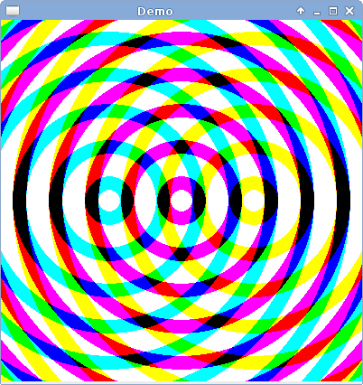

GLFX -- a framework for OpenGL-based 2D graphics
================================================

Basic idea: create an OpenGL rectangle that covers the drawing surface and 
use a user-supplied GLSL fragment shader to render it.

Two independent modules, 'XDL' and 'glfx' provide the necessary functionality:

- XDL is an event-driven framework for OpenGL applications.
- glfx is a set of functions for doing 2D drawing with GLSL.

XDL
---

XDL and provides one function, `XDL_Main()`, that sets up the XDL application.
`XDL_Main()` takes a pointer to an `XDL_Options` struct that contains the 
following fields:

- `char *title`: a string used for the window title.
- `int width`, `int height`: the dimensions of the drawing surface.
- `int frameRate`: the number of times per second to update the drawing
  surface.  May be -1, in which case there is no delay between updates.

The remaining fields are pointers to functions that are called when certain 
events occur.  Any of these may be `NULL`.

- `void (*init)(void)`: a function to be called once when the application 
  starts.
- `void (*update)(unsigned int timestamp)`: a function to be called on each 
  frame update.
- `void (*redraw)(unsigned int timestamp)`: a function to be called each time 
  the drawing surface is redrawn.
- `void (*exit)(void)`: a function to be called once when the application 
  finishes.

XDL requires SDL.

glfx
----

Provides the following functions:

- `void glfxSetup(const char *fragShaderStr)`: sets up the drawing surface 
  with the provided GLSL fragment shader.
- `GLint glfxGetUniformLocation(const GLchar *name)`: returns the location of 
  the named uniform within the shader program.  This location is used to 
  update the uniform via the `glUniform*()` functions.
- `void glfxRedraw(void)`: re-render the drawing surface.

Example program
---------------

The `main.c` and `frag.glsl` files in this directory make up an example 
program demonstrating how the XDL and glfx modules can be used.  Run `make` to 
build the demo (requires OpenGL and SDL).

